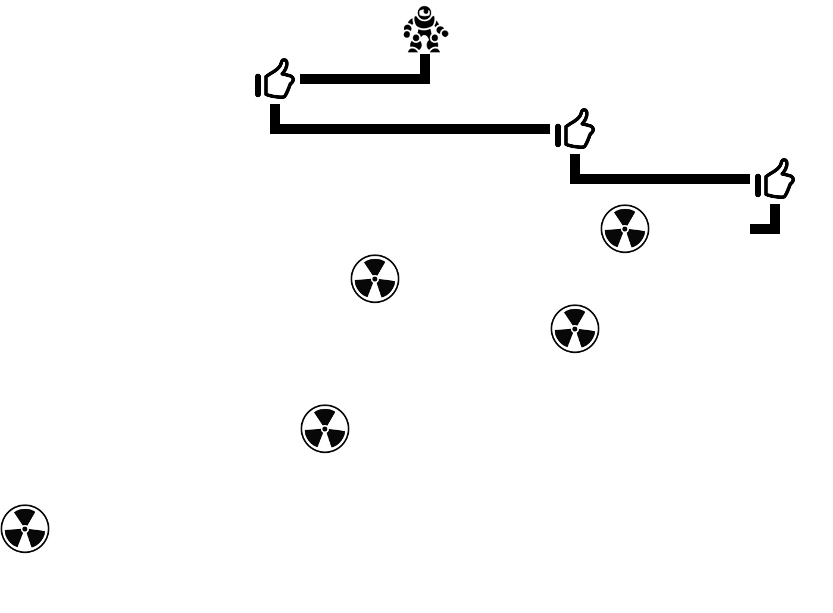

# BombSquad

## Description
This is a programming exercise for a job interview written in [Xtend](https://www.eclipse.org/xtend/). The program has to generate an n x m sized board and randomly place specified number of reactors. After initializing the board, a route is calculated and drawn for the bomb squad in order to reach all the reactors and eliminate the danger.

## Build
`mvn clean package`

## Execution
`mvn exec:java`

## Screenshot

